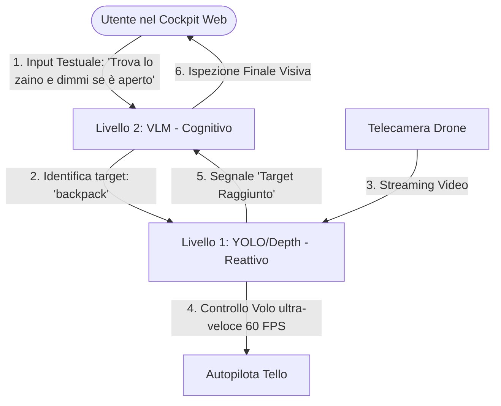
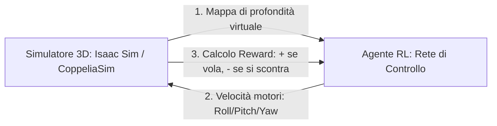

# Proposta di Espansione: Architettura Multi-Modello (VLM + TensorRT)

Per creare un sistema veramente professionale, non dobbiamo usare un solo modello, ma implementare un'**Architettura Ibrida Gerarchica**. Questo è lo schema usato dalle aziende che producono auto a guida autonoma o robot industriali (come Tesla o Boston Dynamics):



---

## 🧠 Come lavorano insieme VLM + Modelli Reattivi

Le VLM (come SmolVLM) sono incredibilmente intelligenti ma molto lente (1-2 secondi per risposta). I modelli di rilevamento (come YOLO) sono velocissimi (2-3 millisecondi) ma non hanno capacità di ragionamento. Unendoli, otteniamo il meglio di entrambi i mondi:

1.  **La Missione (VLM)**: Tu digiti nella dashboard: *"Cerca il mio zaino rosso, vola vicino a lui e controlla se è aperto"*.

## 🎯 Come funziona il Blocco a "1 metro di distanza" (Range Holding)

Se vuoi che il drone agganci un oggetto specifico (es. *"resta a 1 metro dal pupazzo"* o *"resta a 1 metro dalla persona con i capelli ricci"*), il sistema fa questo calcolo continuo:

1.  **L'aggancio**: La VLM localizza l'oggetto e passa il riquadro a YOLO.
2.  **Calcolo della distanza**: Tramite la mappa di profondità (o l'altezza del box di YOLO), misuriamo la distanza attuale dell'oggetto (es: $2.4\text{ metri}$).
3.  **Calcolo dell'Errore**: Vogliamo stare a $1.0\text{ metro}$, quindi l'errore è: 
    $$\text{Errore} = \text{Distanza Attuale} - \text{Distanza Target} = 2.4 - 1.0 = +1.4\text{ metri}$$
4.  **Movimento**: Poiché l'errore è positivo ($+1.4$), Python dice al drone di avanzare lentamente. 
5.  **Correzione dinamica**: Se la persona o il pupazzo si spostano in avanti verso il drone, la distanza scende a $0.7\text{ metri}$ (errore: $-0.3\text{ metri}$). Python dice immediatamente al drone di retrocedere di $30\text{ cm}$.

Il drone rimarrà letteralmente "incollato" a 1 metro dal bersaglio, muovendosi avanti e indietro per compensare i movimenti dell'oggetto!

---

## 📂 Struttura Modulare del Progetto (Standard Clean Architecture)

> [!NOTE]
> **Importante**: Non dobbiamo cambiare la struttura del codice adesso! Per ora lasciamo la cartella esattamente com'è. Questa riorganizzazione verrà fatta in modo graduale e controllato solo quando inizieremo a scrivere il nuovo codice, per evitare di rompere il sistema funzionante attuale.

Ecco come si mapperanno **tutti i file attuali del tuo progetto** (inclusi quelli che abbiamo già scritto come `latency_queue.py` o `vlm_worker.py`) all'interno della futura struttura modulare:

```text
Tello-VLM-project/
│
├── models/                           # [NUOVA] Pesi delle AI (esclusi da Git)
│   ├── gguf/                         # SmolVLM2 GGUF (già presente in llama_models/)
│   ├── onnx/                         # Modelli esportati in ONNX
│   └── tensorrt/                     # Modelli compilati in .engine per la GPU
│
├── scripts/                          # [NUOVA] Script di installazione e lanciatori
│   ├── setup_llama_cpp.py            # (Spostato dalla root) Script di configurazione
│   └── run_llama_server.bat          # (Spostato dalla root) Lanciatore del server llama.cpp
│
├── src/                              # [NUOVA] Cartella dei sorgenti del progetto
│   │
│   ├── tello_control/                # MODULO 1: Interfaccia fisica con il drone
│   │   ├── __init__.py
│   │   ├── tello_drone.py            # (Spostato da drone/) Wrapper API Tello
│   │   ├── video_streamer.py         # (Spostato da drone/) Ricevitore H.264
│   │   └── latency_queue.py          # (Spostato da drone/) Coda a latenza zero
│   │
│   ├── perception/                   # MODULO 2: Modelli AI e pipeline visive
│   │   ├── __init__.py
│   │   ├── vlm_worker.py             # (Spostato da drone/) Client HTTP Llama.cpp
│   │   ├── yolo_trt.py               # [NUOVO] YOLOv8 in TensorRT
│   │   └── depth_trt.py              # [NUOVO] Stima Profondità in TensorRT
│   │
│   ├── autopilot/                    # MODULO 3: Il coordinatore di volo
│   │   ├── __init__.py
│   │   └── controller.py             # [NUOVO] Logica di controllo PID e inseguimento
│   │
│   └── web_dashboard/                # MODULO 4: Interfaccia Web Flask
│       ├── __init__.py
│       ├── web_server.py             # (Spostato da drone/) Server web Flask
│       └── templates/
│           └── index.html            # (Spostato da templates/) Dashboard HUD
│
├── main.py                           # [NUOVO] Punto d'ingresso principale nella root
├── requirements.txt                  # Elenco nudo e crudo di tutte le librerie
└── README.md
```

---

## 🧠 SmolVLM2-2.2B è in grado di farlo bene?

**Sì, la versione da 2.2B è fondamentale per questo compito.**
*   **SmolVLM-500M (Modello piccolo)**: Ha una comprensione visiva limitata. Se gli chiedi di trovare *"la persona con i capelli ricci"* o *"il pupazzo a forma di orso"*, potrebbe confondersi facilmente con altre persone o con cuscini/oggetti sullo sfondo, fornendo coordinate sbagliate.
*   **SmolVLM2-2.2B (Modello grande)**: Ha un vocabolario e una capacità di dettaglio visivo enormemente superiori. Riconosce aggettivi complessi come "capelli ricci", colori specifici di vestiti, o tipi di giocattoli (es. distingue un "pupazzo" da una "sedia" o da una "scatola") e fornisce coordinate di grounding stabili e precise.

---

## 🏁 Le Fasi del Piano di Test

Per testare tutto in sicurezza senza rischiare collisioni, suddivideremo lo sviluppo in queste fasi di test:

*   **Fase 1: Test Video e Box (Simulazione su schermo)**
    *   *Cosa si fa*: Accendiamo il drone tenendolo fermo sulla scrivania. Digiti *"trova il gatto/pupazzo"* nella dashboard. L'IDE deve disegnare a schermo il box intorno al pupazzo e stimare la distanza (es: "1.2 metri"), stampando nel terminale i comandi di velocità teorici che invierebbe ai motori. **I motori per ora non girano.**
*   **Fase 2: Test di Rotazione (Yaw Lock)**
    *   *Cosa si fa*: Facciamo decollare il drone e lo facciamo rimanere fermo in aria (hovering). Spostiamo il pupazzo a destra o sinistra. Il drone deve solo ruotare su se stesso per tenerlo al centro, senza spostarsi in avanti o indietro.
*   **Fase 3: Test di Distanza (Range Lock)**
    *   *Cosa si fa*: Abilitiamo il movimento avanti/indietro. Allontaniamo o avviciniamo il pupazzo. Il drone deve avanzare o arretrare per mantenere la distanza fissa di 1 metro.

---

## ⚡ Perché usare TensorRT (NVIDIA) e come funziona?

**ONNX** è un ottimo formato di interscambio universale, ma **TensorRT** è il compilatore proprietario di NVIDIA che prende un modello ONNX e lo ottimizza specificatamente per l'architettura fisica della tua GPU (la GTX 1650).

### I vantaggi di TensorRT:
*   **Fusione dei Layer**: Unisce più operazioni matematiche della rete neurale in una sola, riducendo i passaggi in memoria.
*   **Selezione dei Kernel**: Trova gli algoritmi matematici più veloci per la tua specifica GPU.
*   **Latenza dimezzata**: Riduce il tempo di calcolo di YOLO da 5-6ms (ONNX) a **1.5 - 2.5ms (TensorRT)**, lasciando la GPU quasi completamente libera per altri calcoli.

### Il flusso di lavoro che implementeremo:
1.  **Esportazione**: Prendiamo il modello in formato PyTorch (`.pt`) e lo convertiamo in formato universale ONNX (`.onnx`).
2.  **Compilazione**: Usiamo lo strumento `trtexec.exe` di NVIDIA TensorRT per compilare il file `.onnx` in un motore serializzato specifico per la GTX 1650 (file **`.engine`** o **`.trt`**).
3.  **Esecuzione in Python**: Nel nostro file `vlm_worker.py` (che diventerà `perception_worker.py`), carichiamo il file `.engine` tramite la libreria Python `tensorrt` ed eseguiamo l'inferenza ultra-rapida passando le immagini direttamente in memoria GPU (tramite puntatori CUDA).

---

## 🛠️ Come vogliamo procedere?

## 🛠️ Studio di Fattibilità Tecnica e Architettura di Volo

Per prima cosa, facciamo chiarezza sui limiti fisici e hardware, per essere sicuri al 100% che tutto questo possa girare in sicurezza sulla tua configurazione.

---

### 1. Calcolo del consumo VRAM (GTX 1650 con 4GB)
Sì, **4GB di VRAM sono sufficienti** grazie all'architettura disaccoppiata che abbiamo creato. Ecco il calcolo reale del consumo di memoria:

*   **Sistema Operativo Windows + Browser**: ~800 MB VRAM
*   **Server Llama.cpp (SmolVLM2-2.2B Q4_K_M + Projector)**: ~1550 MB VRAM (grazie alla quantizzazione a 4-bit)
*   **Modello YOLOv8-nano (Compilato in TensorRT)**: ~300 MB VRAM
*   **Modello Depth (MiDaS-small in TensorRT)**: ~400 MB VRAM
*   **Totale stimato a riposo (Idle)**: **~3.05 GB VRAM** (sui 4GB disponibili della tua scheda video).

#### ⚠️ Gestione dei Picchi di VRAM (KV-Cache Spike Prefill)
Quando la VLM viene "svegliata" per analizzare un'immagine, la sua Context Window si riempie di token visuali e testuali, causando un **picco istantaneo di memoria** (spike) che potrebbe sforare gli 800 MB rimasti liberi, mandando la GPU in Out-Of-Memory (OOM) e facendo crashare il sistema.

Per blindare la stabilità sulla GTX 1650, applicheremo questi limiti rigidi nella configurazione di `llama.cpp`:
1.  **Limitatore di Contesto (`n_ctx = 512` o `1024`)**: "Segiamo" brutalmente la memoria temporanea allocabile per la cache dei token.
2.  **Limitatore di Generazione (`max_tokens = 40`)**: Evita che il modello si allunghi in descrizioni chilometriche che espandono la KV Cache.
3.  **Risoluzione Visuale Fissa (`378x378`)**: Riducendo il frame all'origine, limitiamo il numero fisico di token visuali prodotti dal codificatore d'immagine (`mmproj`), azzerando lo spike iniziale.

---

### 2. Il limite della Telecamera Frontale: come atterrare se non vede sotto?
Il Tello ha solo una telecamera frontale. Quando vola in avanti per atterrare su un punto del pavimento, a un certo punto quel punto **scomparirà sotto l'inquadratura**. Come risolviamo questo limite geometrico?

Usiamo la tecnica del **Decadimento Geometrico con Handover alla Telemetria**:
1.  **Avvicinamento Visuale**: Il drone vede lo spot di atterraggio *in avanti sul pavimento*. Vola verso di esso scendendo a scivolo (in diagonale), mantenendolo visibile nella telecamera frontale.
2.  **Handover Inerziale**: Quando il drone arriva molto vicino e il punto sparisce dal bordo inferiore del video, il codice Python disattiva la telecamera e legge i sensori di telemetria del Tello (ToF per l'altezza, e il barometro).
3.  **L'ultimo metro**: Python dice al drone di fare un piccolo scivolamento in avanti di precisione (es. 20 cm) basandosi sull'ultimo dato salvato, stabilizza il volo (hovering) e lancia il comando di atterraggio `land()`.

---

### 3. A cosa serve veramente YOLO se c'è già la VLM?
La VLM è il "cervello pensante", ma è **lenta (1-2 secondi per risposta)**. Se usassimo solo la VLM per centrare un oggetto, il volo sarebbe a scatti, instabile e pericolosissimo: il drone si muoverebbe per 10 cm, rimarrebbe fermo 2 secondi ad aspettare la VLM, poi altri 10 cm, e così via.

**YOLO (TensorRT)** serve per il **Controllo Reattivo a 60 FPS**:
*   La VLM dice una sola volta: *"Vedo la persona a queste coordinate dello schermo"*.
*   **YOLO** riceve questa informazione, "aggancia" visivamente la sagoma della persona ed esegue il tracciamento fluido a 60 FPS senza alcuna latenza. 
*   Se la persona si sposta velocemente, YOLO corregge i motori istantaneamente. La VLM non deve fare nulla finché la persona non si ferma o cambia la missione.

---

## 🧭 Roadmap di Sviluppo per Step (Fattibilità Incrementale)

Per evitare di stravolgere il codice tutto in una volta, procederemo a piccoli passi verificabili singolarmente:

### 📍 Step 1: Il Rilevatore Silenzioso (YOLOv8 ONNX / TensorRT)
*   **Cosa fare**: Installiamo `onnxruntime-gpu` o le librerie TensorRT. Carichiamo un modello YOLOv8-nano standard.
*   **Verifica**: Guardiamo il video sul browser: dobbiamo vedere le bounding box neon apparire intorno a te a 60 FPS stabili, verificando che il tempo di calcolo sia inferiore a 5ms. Il drone per ora non si muove.

### 📍 Step 2: Il Grounding della VLM
*   **Cosa fare**: Proviamo a mandare un'immagine a SmolVLM chiedendogli di individuare un oggetto e restituire le coordinate testuali (es: `[x_center, y_center]`).
*   **Verifica**: Stampiamo le coordinate nel terminale per verificare che la VLM sia in grado di localizzare l'oggetto richiesto con precisione.

### 📍 Step 3: L'Aggancio (VLM -> YOLO)
*   **Cosa fare**: Colleghiamo i due modelli. Diciamo alla VLM di trovare un oggetto. Python prende le coordinate trovate dalla VLM e dice a YOLO: *"Cerca l'oggetto più vicino a queste coordinate e comincia a tracciarlo"*.
*   **Verifica**: Su schermo dobbiamo vedere YOLO che si "aggancia" all'oggetto identificato inizialmente dalla VLM.

### 📍 Step 4: Il Volo Autonomo di Precisione
*   **Cosa fare**: Colleghiamo i calcoli di errore orizzontale/verticale di YOLO ai comandi `send_rc_control` del drone.
*   **Verifica**: Fai decollare il drone. Spostati nella stanza e verifica che il drone ruoti e si muova autonomamente per seguirti mantenendoti al centro dello schermo.

---

## 📐 Meccanica Matematica per il Calcolo della Distanza (Geometria + Depth)

Per stimare i metri reali dal bersaglio ed evitare collisioni senza sensori fisici sul Tello, combineremo due tecniche separate, ciascuna adatta al suo scopo:

### 1. La Distanza Metrica dal Bersaglio: Geometria dei Triangoli Simili (YOLO)
I modelli di profondità monoculari come **MiDaS** non sono metrici: non dicono *"2.4 metri"*, ma restituiscono un valore di profondità *relativa* (es. disparità scalata da 0 a 255). 

Per ottenere la distanza in metri assoluti dal bersaglio a costo computazionale zero, usiamo la **geometria ottica**:
*   **Altezza reale nota ($H$)**: Conosciamo l'altezza o la larghezza fisica media dell'oggetto (es. una sedia è alta $\sim 80\text{ cm}$, una persona è alta $\sim 170\text{ cm}$).
*   **Lunghezza Focale della Camera ($F$)**: Calcolata una sola volta in fase di calibrazione della telecamera del Tello.
*   **Altezza in Pixel ($h$)**: Misurata istantaneamente a 60 FPS tramite l'altezza in pixel del bounding box di YOLO.
*   **Formula della Distanza ($D$)**:
    $$D = \frac{H \times F}{h}$$
    Questa operazione geometrica restituisce i metri effettivi con precisione millimetrica all'avvicinarsi del drone, senza pesare sulla GPU.

### 2. Evitamento Ostacoli Generici: Profondità Relativa (MiDaS in TensorRT)
Poiché non possiamo conoscere a priori l'altezza di un muro o di un ostacolo imprevisto, usiamo **MiDaS** per evitare le collisioni:
*   MiDaS analizza la scena e rileva la variazione di pendenza (gradiente) della profondità.
*   Se un'area dello schermo mostra pixel ad altissima disparità (vicini al valore massimo), significa che c'è un ostacolo piatto imminente (un muro, un mobile).
*   Il sistema intercetta questa variazione relativa e blocca il volo in avanti per sicurezza.

---

## 🎯 Piani Futuri di Fine-Tuning e Specializzazione

Se in futuro incontriamo oggetti strani non riconosciuti o compiti industriali complessi, possiamo addestrare i nostri modelli su misura:

### 1. Fine-Tuning di YOLO (Riconoscimento di Oggetti Custom)
Se vuoi tracciare un oggetto unico (es. un telecomando specifico, una scatola aziendale, o un drone amico):
*   **Dataset**: Scattiamo 150-200 foto dell'oggetto da varie angolazioni usando la telecamera del Tello.
*   **Etichettatura**: Usiamo strumenti gratuiti come **Roboflow** per disegnare i box intorno all'oggetto.
*   **Addestramento**: Eseguiamo il Fine-Tuning di YOLOv8-nano tramite PyTorch (su Google Colab gratuito in 15 minuti).
*   **Esportazione**: Convertiamo il modello addestrato in `.onnx` e poi lo compiliamo in `.engine` con TensorRT per caricarlo sul drone.

### 2. Fine-Tuning della VLM (SmolVLM2-2.2B LoRA)
Se vuoi insegnare alla VLM come rispondere a domande molto specifiche su un impianto (es. *"La valvola di sicurezza è in posizione aperta o chiusa?"*):
*   Addestriamo un piccolo adattatore **LoRA** (Low-Rank Adaptation) fornendo coppie di Immagine + Domanda/Risposta.
*   Convertiamo i pesi finali in formato GGUF e li carichiamo in `llama_models/` per l'uso immediato.

---

## 🤖 Piani Futuri di Reinforcement Learning in Simulazione

Per far navigare il drone in modo completamente autonomo in ambienti caotici (schivando mobili, sedie e ostacoli dinamici) senza programmare regole a mano, useremo l'apprendimento per rinforzo:



### Il Piano d'Azione per la Simulazione:
1.  **Il Simulatore (NVIDIA Isaac Sim o CoppeliaSim)**: Creiamo un gemello virtuale del drone Tello in un ambiente 3D che replica la tua casa o il tuo ufficio.
2.  **L'Ambiente di Addestramento (Gymnasium)**: Creiamo un'interfaccia Python standard dove lo stato (observation) è l'immagine di profondità stimata e la posizione del target, e le azioni sono le velocità del drone.
3.  **L'Algoritmo (PPO con Stable Baselines3)**: Addestriamo l'agente a volare verso l'obiettivo. Il drone virtuale riceve un punteggio positivo (**reward**) se si avvicina al bersaglio e una penalità negativa enorme se si scontra con una parete.
4.  **Sim-to-Real**: Esportiamo la rete neurale addestrata in formato ONNX/TensorRT e la eseguiamo sul PC collegato al Tello reale. Il drone schiverà gli ostacoli nella stanza reale con la stessa fluidità testata nel simulatore virtuale!

---

### Da quale Step vuoi iniziare nella prossima sessione?
Ti consiglio lo **Step 1** (integrare YOLO ed eseguire l'ottimizzazione ONNX/TensorRT sul flusso video esistente della dashboard). È il più sicuro e ti permette di vedere subito i risultati grafici a schermo!


